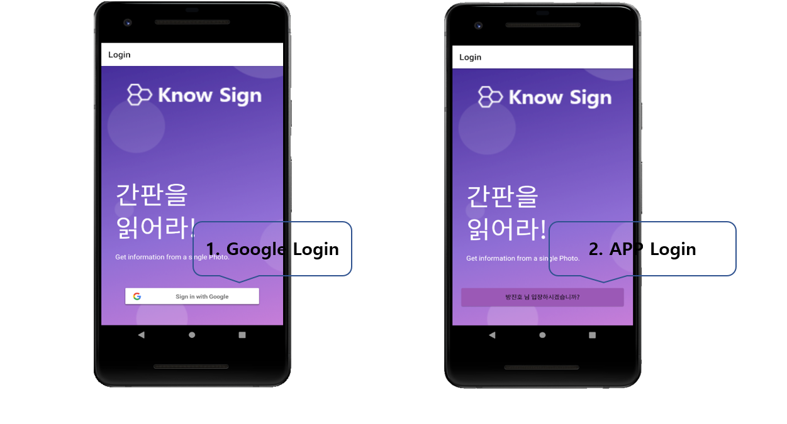
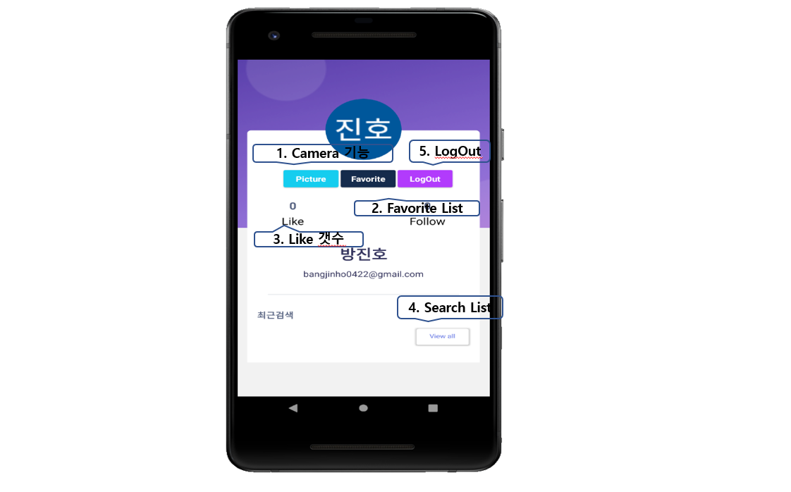
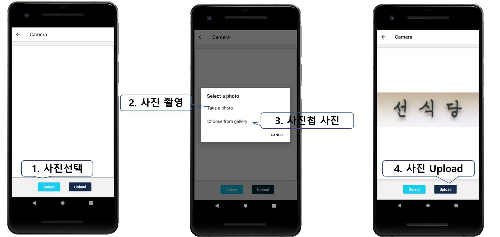
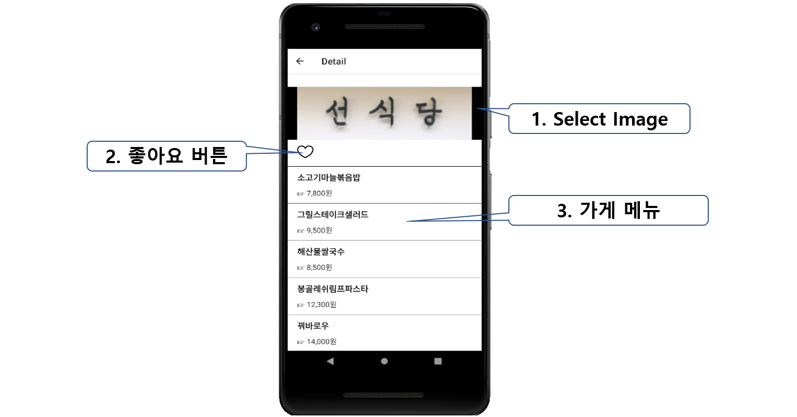
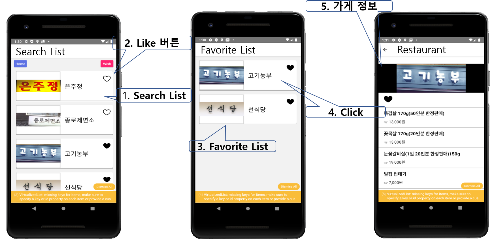

# 🏆"**Know Sign**" AI Application 

## 💛Project Function Versions💛

## 🎆Introduction💘

`Know Sign Application`은 딥러닝을 통해 가게 간판이미지에서 텍스트를 추출하여 가게에 대한 정보를 얻을 수 있는 Application 입니다.

남녀노소, 나이상관없이 누구나 `Know Sign Application`을 통해 일상생활에서 간편하게 가게 간판이미지 한 장을 찰칵! 촬영을 통해 가게에 대한 모든 정보를 볼 수 있습니다. 

## 🛒Installation💗

- Android Base(ios (x))
- [app-release.zip](https://drive.google.com/open?id=1XmmCGsAzUJKXID8-rTQnRWcIcmZAFcFj)

1. `app-release.zip` 다운 후 압축 해제
2. `android setting ` 에서 출처를 알 수 없는 앱 허용
3. 설치 완료후 `Manual` 참고하여 사용

## 🎮Manual💝

#### - Login

1. `Google Login 연동`
   - Google Login을 통해 회원가입을 하지않아도 Login, Google Drive사용이 가능하다.
2. `Know Sign Application 입장 버튼`
   - 입장 버튼을 통해 Application에 입장할 수 있다.

#### - Main Page

1. `Camera 기능 버튼`
   - Camera 기능을 사용하여 간판 Image를 촬영할 수 있다.
2. `Favorite(좋아요 가게) List 버튼`
   - "좋아요"를 누른 가게의 List를 볼 수 있다.
3. `Like(좋아요 가게) 갯수 연동`
   - "좋아요"를 누른 가게의 갯수를 알 수 있다
4. `Search List 버튼`
   - 현재까지 search한 모든 가게 List를 볼 수 있다.

#### - Camera

1. `Select 버튼`
   - 사진을 선택할 방법을 고를 수 있다.
2. `사진 촬영 버튼`
   - 간판 이미지를 직접 찍을 수 있는 카메라를 연동할 수 있다.
3. `Choose from gallery 버튼`
   - 스마트폰 사진첩에서 간판 이미지를 직접 넣을 수 있다.
4. `UpLoad 버튼`
   - 사진을 직접찍거나 사진첩에서 가져온 간판 이미지의 텍스트를 추출한다.

#### - Image Upload

1. `Select Image`
   - UpLoad버튼을 통해 텍스트를 추출한 이미지를 보여준다.
2. `좋아요 버튼`
   - "좋아요" 버튼을 통해 나의 Favorite List에 저장할 수 있다.
3. `가게 메뉴`
   - 간판이미지에서 추출한 텍스트를 통해 가게의 메뉴와 가격을 보여준다.

#### - List

1. `Search List`
   - 현재까지 Search한 모든 가게를 보여준다.
2. `좋아요 버튼`
   - "좋아요" 버튼을 통해 나의 Favorite List에 저장할 수 있다.
3. `Favorite List`
   - "좋아요"를 누른 가게를 보여준다.
4. `가게 Card 버튼`
   - 가게 Card 버튼을 누를시 가게에 대한 정보를 보여준다.
5. `가게 정보`
   - 가게 Card버튼 클릭시 가게에 대한 상세 정보를 볼 수 있다.

## 🎈Future Plans💟

1. Follow 기능을 통해 "Know Sign"을 이용하는 다른 사용자의 Favorite List Search 가능 기능구현!
2. 가게에 대한 리뷰 및 평점을 달 수 있는 기능구현!
3. GPS를 활용하여 가게위치정보 획등 기능구현!